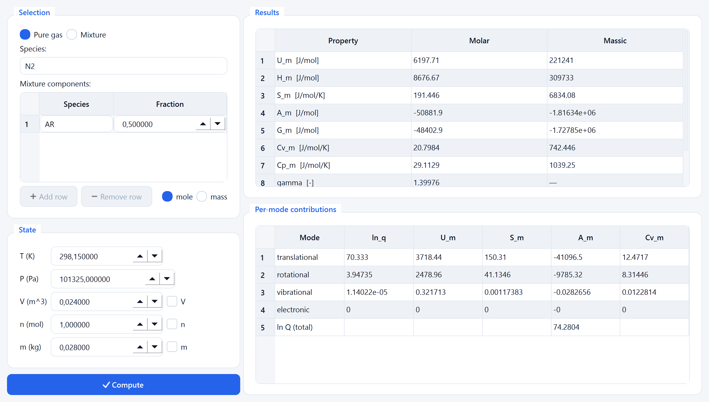
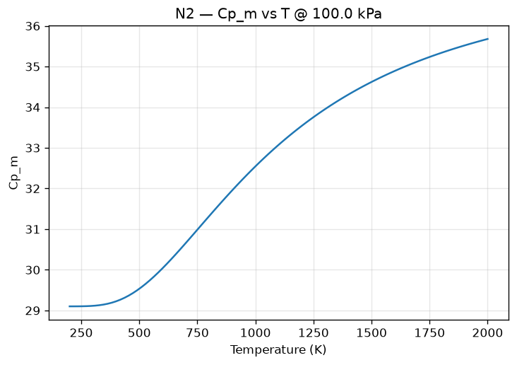

# StatThermoPy

**Author:** I. L. Ferreira &lt;<ileao@ufpa.br>&gt;

A Python simulator that computes the thermodynamic properties of ideal gases
**exclusively from statistical mechanics** — via the molecular partition function

$$Q = Q_t \, Q_r \, Q_v \, Q_e$$

— with **no empirical property correlations** (no NASA polynomials, JANAF,
Shomate, CoolProp or REFPROP). Empirical reference data is used only for
*optional* validation, never for the calculation itself.

<p align="center">
  
</p>

<p align="center"><em>The StatThermoPy Qt GUI (Properties tab): choose a gas or
build a mixture, set the thermodynamic state, and read the computed properties
and per-mode breakdown — with live light/dark theming.</em></p>

## Overview

StatThermoPy builds every thermodynamic property from a molecule's own
microscopic constants — its mass, geometry, symmetry number, rotational and
vibrational temperatures, and electronic levels. From the translational,
rotational (rigid rotor / exact quantum J-sum), vibrational (quantum harmonic
oscillator), hindered-internal-rotation (1-D Mathieu-eigenvalue rotor, for
single-bond torsions such as the methyl tops of ethane and propane) and
electronic partition functions it derives the internal energy,
enthalpy, entropy, Helmholtz and Gibbs energies, heat capacities, the specific
heat ratio and the chemical potential, on both molar and massic bases, for pure
gases and ideal-gas mixtures.

Because the physics is first-principles, the same engine is a **teaching tool**
(you can see each mode's contribution), a **research utility** (a 22-species
database, exportable tables, property-vs-temperature plots), and a **verified
calculator** (automatic cross-checks against embedded NIST/JANAF reference data).
It ships a scientific CLI, an optional Qt GUI, and pluggable NumPy / Numba /
OpenMP / CUDA execution backends that change only the numerics, never the physics.

StatThermoPy is a companion simulator to the textbook *Statistical
Thermodynamics: Theory, Computation, and Molecular Applications — A Computational
Approach with Python* by I. L. Ferreira: it is the applied, first-principles
engine behind the book's statistical-thermodynamics chapters.

## Key features

- **Pure statistical mechanics.** Properties come from `Q = Q_t·Q_r·Q_v·Q_e`
  alone — no empirical correlations enter the calculation path.
- **All ideal-gas classes.** Monoatomic, diatomic, linear- and nonlinear-
  polyatomic molecules.
- **Hindered internal rotation.** Single-bond torsions (the methyl tops of
  ethane and propane) are treated as 1-D hindered rotors via exact
  Mathieu-eigenvalue diagonalisation — spanning the free-rotor and
  harmonic-oscillator limits — rather than as harmonic oscillators.
- **Every standard property.** `U, H, S, A, G, Cv, Cp, γ, μ` and the total
  partition function, on **molar and massic** bases, plus a per-mode breakdown.
- **Ideal-gas mixtures.** Compose by mole or mass fraction.
- **22-species database.** Curated YAML files (spectroscopic constants),
  trivially extensible by dropping in a new YAML.
- **Automatic validation.** Cross-check the engine against embedded NIST/JANAF
  reference `Cp°`/`S°` for all 22 species — worst case `Cp` 3.9 %, `S` 1.4 %.
- **Scientific CLI.** An interactive terminal and a one-shot `run` command.
- **Optional Qt GUI.** PySide6 window with Properties / Plot / Validate tabs and
  a live light/dark theme.
- **Plots & export.** Property-vs-temperature figures; export to
  CSV / JSON / YAML / Excel / LaTeX.
- **Performance backends.** NumPy (default), Numba, OpenMP and CUDA — same
  physics and API, machine-precision-identical results, 100×+ speedups.
- **Tested.** 284 tests, ~96 % coverage.

## Screenshots

The Qt GUI (Properties tab) is shown at the top of this README. The engine also
produces **property-vs-temperature plots** directly — the molar heat capacity of
N₂ is shown below:



More generated figures — `U, H, S, A, G, Cv, Cp, γ` and each partition-function
factor — live in [`examples/output/`](examples/output/).

## Installation

StatThermoPy requires **Python ≥ 3.11**. From the project root (the directory
containing `pyproject.toml`):

```bash
python -m pip install -e ".[dev]"          # core + CLI + test/dev tools
python -m pip install -e ".[dev,gui]"       # ... plus the Qt GUI (PySide6)
python -m pip install -e ".[dev,accel]"     # ... plus Numba / OpenMP CPU acceleration
python -m pip install -e ".[dev,gui,accel]" # everything
```

A minimal runtime install (no dev tooling) is simply:

```bash
python -m pip install -e .
```

### Dependencies

| Package | Minimum | Purpose | Required |
|---|---|---|---|
| `numpy` | 1.26 | array computing | ✅ core |
| `pyyaml` | 6.0 | species / reference database | ✅ core |
| `pandas` | 2.0 | tables and export | ✅ core |
| `matplotlib` | 3.7 | property-vs-T plots | ✅ core |
| `openpyxl` | 3.1 | Excel (`.xlsx`) export | optional `[excel]` |
| `PySide6` | 6.6 | Qt GUI | optional `[gui]` |
| `numba` | 0.60 | Numba / OpenMP / CUDA backends | optional `[accel]`, `[cuda]` |

The accelerated backends and the GUI import **lazily** — `import statthermopy`
never pulls in `numba` or `PySide6`.

## Quick start

### Python API

```python
from statthermopy import Thermodynamics, State
from statthermopy.database import get

n2 = get("N2")                       # molecular constants from the database
st = State(T=298.15, P=101325.0)     # thermodynamic state
th = Thermodynamics(n2, st)

props = th.compute()                 # ThermoProperties: molar (_m) and massic (_s)
print(props.Cp_m, props.S_m, props.gamma)   # 29.1129  191.446  1.3998
```

### Mixtures

```python
from statthermopy import IdealGasMixture, State

air = IdealGasMixture.from_names({"N2": 0.78, "O2": 0.21, "Ar": 0.01})
props = air.compute(State(T=298.15, P=101325.0))
print(props.Cp_m, props.gamma)
```

### Command-line interface

Interactive scientific terminal:

```text
$ statthermopy
> gas N2
> T = 298.15
> P = 101325
> properties
```

One-shot computation, optionally exporting a table:

```bash
statthermopy run --gas N2 --T 298.15 --P 101325
statthermopy run --mixture Ar:0.7 N2:0.3 --T 1000 --basis mass
statthermopy run --gas CO2 --T 800 --export csv co2.csv
```

### Property-vs-temperature plots

```python
import numpy as np
from statthermopy import Thermodynamics, State
from statthermopy.database import get

th = Thermodynamics(get("N2"), State(T=300.0, P=101325.0))
T, Cp = th.property_vs_T("Cp_m", np.linspace(200.0, 2000.0, 400))
# ... plot with matplotlib, or use statthermopy.plots helpers
```

### Export

```python
from statthermopy.io import Exporter

Exporter(th.properties()).to_json("n2.json")   # also: to_csv, to_yaml, to_excel, to_latex
```

## Validation

Cross-check the first-principles engine against embedded NIST/JANAF reference
tables. **Only reference *values* ship** — no correlation coefficients — so the
calculation core stays pure statistical mechanics:

```python
from statthermopy.validation import validate, list_references

print(list_references())            # all 22 species in the database
r = validate("N2", "Cp")
print(r.mean_abs_error_percent)     # ~0.38 % (rigid-rotor / harmonic-oscillator)
```

Or run the bundled example, which reports the actual worst-case error across all
species:

```bash
python examples/validate.py
```

Reference `Cp°`/`S°` were produced by evaluating the NIST WebBook Shomate
equations (20 species) and the NASA Glenn polynomials (C₂H₆, C₃H₈) on a fixed
temperature grid; the coefficients themselves are **not** shipped. Worst case
across all 22 species: `Cp` 3.9 % (H₂ at high T), `S` 1.4 %.

## Performance backends

The engine routes its array work and hot loops through a pluggable `Backend`
ABC. The default `numpy` backend is always available; three accelerated backends
are selectable at runtime — **same physics, same API, only the numerical
execution changes**:

```python
from statthermopy.backend import set_backend, list_backends, available_backends

print(list_backends())        # ['numpy', 'numba', 'openmp', 'cuda']
print(available_backends())   # those importable here (cuda only with an NVIDIA GPU)

set_backend("numba")          # @njit CPU kernels (quantum J-sum + T-batched grid)
set_backend("openmp")         # @njit(parallel=True) + prange over the T grid
set_backend("cuda")           # numba.cuda GPU; auto-falls back to Numba CPU (+ warning)
```

Results are identical to the NumPy path to machine precision (0.0e+00 relative
error verified for N₂/CO₂/H₂). On a 2000-point property grid the accelerated
backends reach **~270–440× (Numba)** and **~150–300× (OpenMP)** over NumPy.
Benchmark on your machine with:

```bash
python examples/benchmarks.py
```

## Graphical user interface

```bash
python -m pip install -e ".[gui]"
statthermopy-gui        # or: python -m statthermopy.gui.app
```

Three tabs:

- **Properties** — pure-gas or mixture editor, state inputs, results and a
  per-mode breakdown in a two-column layout.
- **Plot** — any property versus temperature on an embedded matplotlib canvas.
- **Validate** — engine vs NIST/JANAF with a coloured PASS/FAIL verdict badge and
  a comparison plot.

The interface uses a semantic light/dark design system (accent buttons,
hover/pressed/disabled states, rounded cards, vector icons); **View → Theme**
toggles Light / Dark / System, and the matplotlib canvases recolour with the
theme. The GUI adds **no physics** — it wraps the same public API as the CLI.

## Project structure

```
STATTHERMOPY/
├── README.md · handoff.md · LICENSE · pyproject.toml
├── src/statthermopy/
│   ├── __init__.py  constants.py  units.py
│   ├── partition.py            Q = Q_t Q_r Q_v Q_e assembly
│   ├── thermodynamics.py       properties from Q (molar + massic, property_vs_T)
│   ├── mixture.py              ideal-gas mixtures (mole / mass fractions)
│   ├── core/                   Molecule, Geometry, State, Contribution
│   ├── modes/                  translational · rotational · vibrational · internal rotation · electronic
│   ├── database/               registry + data/*.yaml   (22 species)
│   ├── validation/             reference + data/*.yaml   (NIST/JANAF Cp°, S°)
│   ├── backend/                executor + numpy / numba / openmp / cuda
│   ├── io/                     exporters (CSV / JSON / YAML / Excel / LaTeX)
│   ├── plots/                  property-vs-T plotting
│   ├── cli/                    scientific terminal (REPL) + one-shot `run`
│   ├── gui/                    PySide6 app · mainwindow · theme
│   └── equilibrium/            chemical-equilibrium architecture (future phase)
├── examples/                   runnable scripts + Jupyter demo + output/ figures
├── tests/                      pytest suite (284 tests, ~96% coverage)
└── docs/                       THEORY.md + Sphinx sources (api.rst, theory.rst)
```

## Supported species

The molecular database currently ships 22 species (list them at runtime with
`statthermopy.list_molecules()`):

> Ar, He, Ne, Kr, Xe · H₂, N₂, O₂, CO, NO, Cl₂ · CO₂, H₂O, N₂O, SO₂, H₂S, NH₃ ·
> CH₄, C₂H₂, C₂H₄, C₂H₆, C₃H₈

Adding a species is a matter of dropping a YAML file (molar mass, geometry,
symmetry number, rotational constants / vibrational fundamentals, electronic
levels) into `src/statthermopy/database/data/`.

## Testing

```bash
python -m pytest -q                       # 284 tests
python -m pytest --cov=statthermopy       # with coverage (~96%)
```

The suite covers the core, modes, partition function, thermodynamics, database,
validation, I/O, the CLI, the GUI, and every execution backend (Numba tests are
skipped automatically if `numba` is not installed; the CUDA backend falls back
to CPU without an NVIDIA GPU).

## Contributing

Contributions are welcome — new species, additional properties, more validation
references, documentation, and performance work. Please keep the project's
defining rule in mind:

> The **calculation core stays pure statistical mechanics.** No empirical
> property correlations (NASA/Shomate/JANAF/CoolProp/REFPROP) may enter the
> calculation path. Empirical data is admissible only as *optional validation
> reference values*, never as calculation coefficients.

Before opening a pull request:

```bash
python -m pip install -e ".[dev,gui,accel]"
python -m pytest -q          # all tests pass
ruff check src tests         # lint clean (config in pyproject.toml)
black --check src tests      # formatting
```

New physics should be **verified** — cross-checked against an exact result, a
limiting case, or the embedded NIST/JANAF references — and any stochastic or
backend-specific code must match the NumPy path to machine precision. Adding a
species means adding both its `database/data/<name>.yaml` and, ideally, a
`validation/data/<name>.yaml` reference.

## Roadmap

Planned and deferred work, roughly in priority order:

- **Chemical equilibrium** — activate the `equilibrium/` architecture: Gibbs-
  energy minimisation, reaction `ΔG°` and `K(T) = exp(−ΔG°/RT)` built entirely
  from the partition-function chemical potentials (no empirical data).
- **Enthalpy validation** — validate `H° − H°(298.15)` via a reference-state
  offset (the engine's `H_m` is absolute; NIST tabulates a referenced enthalpy).
- **Anharmonic / non-rigid corrections** — optional vibrational anharmonicity and
  rotation–vibration coupling beyond rigid-rotor / harmonic-oscillator.
- **More backends & tuning** — a CuPy backend alongside `numba.cuda`, and
  parallelising the quantum J-sum reduction if profiling warrants it.
- **Larger database** — more species and higher-fidelity spectroscopic constants.
- **Packaging & docs** — publish to PyPI and a hosted Sphinx documentation site.

## Citation

If you use StatThermoPy in your work, please cite:

> I. L. Ferreira, *StatThermoPy: statistical thermodynamics in Python — properties
> from the molecular partition function*, 2026.
> <https://github.com/ileaof/statistical-thermodynamics-computation-verification>

```bibtex
@software{ferreira2026statthermopy,
  author  = {Ferreira, I. L.},
  title   = {StatThermoPy: statistical thermodynamics in Python --
             properties from the molecular partition function},
  year    = {2026},
  version = {0.1.0},
  url     = {https://github.com/ileaof/statistical-thermodynamics-computation-verification}
}
```

## License

Released under the [MIT License](LICENSE) — Copyright &copy; 2026 I. L. Ferreira.
