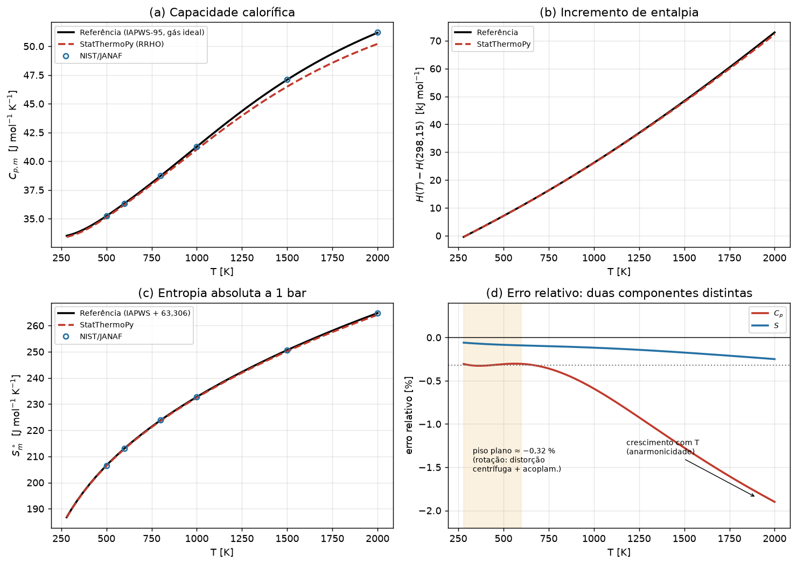

# Auditoria científica do H₂O(g) no StatThermoPy

**Data:** 2026-09-09 · **Versão auditada:** statthermopy 0.1.0 · **Espécie:** H₂O em fase gasosa

---

## 1. Resumo executivo

O motor foi auditado em toda a cadeia — dados moleculares, funções de partição, convenções de
energia e entropia, estado padrão, unidades, contribuições por modo e conversão molar/mássica — e
confrontado com **cinco referências independentes** (JANAF, TRC, NIST WebBook Shomate, Poling e
IAPWS-95 no limite de gás ideal).

**Conclusão: não foi encontrado nenhum erro de implementação, unidade, constante, fórmula, estado
padrão ou zero de energia.** Todas as identidades termodinâmicas fecham à precisão de máquina
(≤ 6 × 10⁻¹¹), *C_p* e *C_v* reproduzem as derivadas numéricas de *H* e *U* com erro relativo
< 10⁻⁶ %, e cada contribuição modal coincide com a fórmula fechada recalculada independentemente
até 10⁻¹⁶ J/mol/K.

As divergências observadas são **reais, mas têm duas origens físicas identificadas e quantificadas,
ambas externas ao código**:

| # | Origem | Classificação | Magnitude |
|---|---|---|---|
| 1 | Distorção centrífuga e acoplamento vibração–rotação, ausentes no rotor rígido | Limitação do modelo (8) | Piso plano de **−0,32 %** em *C_p*, 273–600 K |
| 2 | Anarmonicidade, ausente no oscilador harmônico | Limitação do modelo (9) | Cresce de −0,4 % (800 K) a **−1,90 %** (2000 K) |
| 3 | Não idealidade do vapor real, quando a comparação é feita a 1 bar perto da saturação | Comparação inadequada (7/10) | Até **+9,9 %** a 373,15 K — 30× maior que o erro do motor |

**Nenhuma alteração no motor é necessária ou recomendada.** Dois erros adicionais foram
encontrados, ambos na *documentação* e não no código — e ambos com a mesma origem: uma constante de
referência medida **com o motor dentro da subtração e a 1 bar**, absorvendo o erro do motor e a não
idealidade do vapor. Ver §9.

| Constante | Publicado | Correto | Como se obtém |
|---|---|---|---|
| Deslocamento de entropia | 63,130 J/mol·K | **63,306 J/mol·K** | Entre duas referências; confirmado pela terceira lei em 0,05 % |
| Deslocamento de entalpia | ≈ −1995 kJ/kg | **−1997,852 kJ/kg** | Calor latente no ponto triplo menos a entalpia térmica do gás ideal; confirmado em 0,045 % |

> **Lição metodológica.** Uma constante de referência deve ser medida entre duas referências, ou no
> limite ideal com o erro do objeto sob teste descontado — nunca com esse objeto dentro da medida.

Uma terceira armadilha, específica da água, é analisada na §9.3: a **entropia residual do gelo**
(*R* ln(3/2) = 3,371 J/mol·K). Termodinâmica estatística e clássica concordam, exceto no zero de
entropia — e o gelo é o caso célebre em que a terceira lei calorimétrica falha, por desordem
protônica. Confrontar o motor com uma entropia de terceira lei *não corrigida* produziria um "erro"
espúrio de **+1,8 %**, trinta vezes o desvio real de −0,06 %. As referências usadas nesta auditoria
(JANAF, CODATA, IAPWS) são todas espectroscópicas, e portanto corretas.

---

## 2. Metodologia

Seguiu-se a ordem exigida: reproduzir → documentar → comparar → localizar → propor. **Nenhum
cálculo do motor foi alterado durante a auditoria.**

1. Auditoria estática dos dados moleculares (`database/data/H2O.yaml`) e do código de cada modo.
2. Verificação de identidades termodinâmicas e de derivadas numéricas — testes que não dependem de
   referência externa alguma.
3. Verificação modo a modo contra fórmulas fechadas reimplementadas do zero no script de auditoria.
4. Comparação com referências externas, sempre no mesmo estado padrão e com o mesmo zero de
   referência.
5. Separação do erro do motor da não idealidade do fluido real, por extrapolação a *P* → 0.
6. Teste de falsificação: verificar se algum dado molecular plausível poderia explicar o desvio.

Todos os números deste relatório são reprodutíveis por `tests/test_h2o_audit.py`, que não requer
acesso à internet.

---

## 3. Fontes consultadas

| Fonte | Versão / origem | Fase | Estado padrão | Convenção de referência |
|---|---|---|---|---|
| NIST Chemistry WebBook (Shomate) | via `validation/data/H2O.yaml`, curado 2026-07-31 | gás ideal | 1 bar (10⁵ Pa) | *S* absoluta de terceira lei; grade 500–2000 K |
| IAPWS-95 | pacote `iapws` ≥ 1.5 | fluido real | qualquer (*T*, ρ) | *s* = 0 e *h* = 0 no líquido saturado do ponto triplo (273,16 K) |
| CODATA | *S*°(H₂O, líq., 298,15 K) = 69,95 J/mol·K | líquido | 1 bar | terceira lei |
| JANAF | *S*° = 188,835 e *C_p*° = 33,590 J/mol·K a 298,15 K | gás ideal | 1 bar | terceira lei |

> **Nota sobre a extração da referência IAPWS.** O localizador de raízes de densidade do pacote
> `iapws` converge ocasionalmente para uma raiz espúria a pressões muito baixas: em
> `IAPWS95(T=635, P=1e-6)` retorna ρ = 151 kg/m³ em vez de 3,4 × 10⁻⁶, corrompendo *c_p* e *s*.
> Toda esta auditoria usa a entrada **(T, ρ)** com ρ = *PM*/*RT*, que não exige busca de raiz. Nos
> pontos sadios as duas rotas concordam em 10⁻⁹, e a rota (T, ρ) não apresenta nenhuma anomalia em
> 280–2000 K.

---

## 4. Dados moleculares auditados

Arquivo: `src/statthermopy/database/data/H2O.yaml`

| Item | Valor no banco | Esperado | Veredito |
|---|---|---|---|
| Massa molar | 18,01528 g/mol | 18,0153 | ✅ |
| Geometria | `nonlinear` | não linear (C₂ᵥ) | ✅ |
| Número de átomos | 3 | 3 | ✅ |
| Número de simetria σ | 2 | 2 (rotação C₂) | ✅ |
| Temperaturas rotacionais | 40,13 / 20,87 / 13,36 K | de *A*,*B*,*C* = 27,877 / 14,512 / 9,285 cm⁻¹ | ⚠️ ver abaixo |
| Modos vibracionais | 3 | 3*N*−6 = 3 | ✅ |
| Degenerescências | 1, 1, 1 | 1, 1, 1 (nenhum modo degenerado em C₂ᵥ) | ✅ |
| Números de onda | 3657 / 1595 / 3756 cm⁻¹ | ν₁ / ν₂ / ν₃ fundamentais | ✅ |
| Cada modo aparece uma única vez | sim | sim | ✅ |
| Estado eletrônico fundamental | 0 cm⁻¹, *g* = 1 | X¹A₁, singleto | ✅ |

**Conversões de unidade.** `CM1_TO_K` = *hc*·100/*k_B* = 1,4387768775 K/cm⁻¹, exato para CODATA
2018. As temperaturas vibracionais resultantes são 5261,61 / 2294,85 / 5404,05 K.

**Ida e volta θ → I → θ.** O YAML fornece temperaturas rotacionais; o `Molecule` armazena momentos
de inércia; o modo `Rotational` reconverte para θ. Ambas as direções usam
θ = *h*²/(8π²*I k_B*), e a reconversão devolve 40,1300 / 20,8700 / 13,3600 K — exata.

> ⚠️ **Item menor de precisão (não é a causa do desvio).** As temperaturas do YAML estão
> arredondadas de forma inconsistente com as constantes citadas no comentário: *A* = 27,877 cm⁻¹
> dá θ_A = 40,10878 K, mas o YAML traz 40,13 (+0,053 %). O efeito sobre a entropia é
> Δ*S* = −(*R*/2) ln(Πθ_YAML/Πθ_exato) = **−0,0006 J/mol·K**, ou 0,0003 % de *S*° — **177 vezes
> menor** que o resíduo de 0,106 J/mol·K a explicar. Corrigir é gratuito e recomendável por higiene
> de dados, mas não altera nenhuma conclusão.

---

## 5. Verificação da implementação (independente de referência)

### 5.1 Identidades termodinâmicas

Avaliadas a 1 bar em 298,15 / 300 / 350 / 373,15 / 400 / 500 / 800 / 1000 / 1500 / 2000 K:

| Identidade | Resíduo máximo |
|---|---|
| *C_p* − *C_v* − *R* = 0 | 3,6 × 10⁻¹⁵ |
| *H* − *U* − *RT* = 0 | 3,6 × 10⁻¹² |
| *G* − (*H* − *TS*) = 0 | 5,8 × 10⁻¹¹ |
| *A* − (*U* − *TS*) = 0 | 5,8 × 10⁻¹¹ |
| γ − *C_p*/*C_v* = 0 | 0 |

Todos no nível do arredondamento de ponto flutuante. **Classificação: sem erro de implementação.**

### 5.2 Derivadas numéricas

*C_p* comparado a d*H*/d*T* (diferença central, *δ* = 0,01 K, pressão constante) e *C_v* a
d*U*/d*T* (volume constante):

| *T* [K] | *C_p* motor | d*H*/d*T* | dif. | *C_v* motor | d*U*/d*T* | dif. |
|---|---|---|---|---|---|---|
| 298,15 | 33,481877 | 33,481877 | < 10⁻⁶ % | 25,167414 | 25,167414 | < 10⁻⁶ % |
| 1000 | 41,023592 | 41,023592 | < 10⁻⁶ % | 32,709129 | 32,709129 | < 10⁻⁶ % |
| 2000 | 50,207649 | 50,207649 | < 10⁻⁶ % | 41,893186 | 41,893186 | < 10⁻⁶ % |

As capacidades caloríficas são derivadas analíticas exatas das funções de estado.

### 5.3 Contribuições por modo, a 500 K e 1 bar

Comparadas com fórmulas fechadas reimplementadas do zero (Sackur–Tetrode; rotor rígido assimétrico;
oscilador harmônico de Einstein):

| Modo | *S_m* motor | *S_m* manual | Diferença |
|---|---|---|---|
| Translacional | 155,660402 | 155,660402 | 0 |
| Rotacional | 50,217516 | 50,217516 | 0 |
| Vibracional | 0,480972 | 0,480972 | 7,8 × 10⁻¹⁶ |
| Eletrônico | 0,000000 | 0,000000 | 0 |
| **Total** | **206,358890** | **206,358890** | **0** |

`ln Q_t` = 70,976543 e `ln Q_r` = 4,539779 conferem com o cálculo manual.

**Translacional.** Usa a massa de *uma molécula* (*M*/*N_A*), volume molar *V_m* = *RT*/*P*, e a
correção de indistinguibilidade −ln *N_A* + 1, reproduzindo Sackur–Tetrode. Fatores 2π, *h*², *k_B*
conferidos; dependência *T*^{3/2} e ln(*k_BT*/*P*) corretas.

**Rotacional.** O motor seleciona a expressão de **rotor rígido não linear** —
*Q_r* = (√π/σ)·(*T*³/θ_Aθ_Bθ_C)^{1/2} — confirmado pelo valor exato de ln *Q_r* e por
*C_v,rot* = 3*R*/2. A fórmula linear **não** está sendo aplicada à água. Fator √π presente,
σ = 2 aplicado, expoente 3/2 em *T* correto.

**Vibracional.** *Q_v,i* = 1/(1 − e^{−θ/T}) com o zero de energia em *v* = 0 — **sem energia de
ponto zero**. Cada modo entra uma única vez, sem dupla contagem. A implementação usa `expm1`/`log1p`
na forma e^{−x}, estável para todo *T* ≥ 0 (não há overflow de `exp(x)` a baixa *T*). Limites
verificados: *U_v*, *C_v,v*, *S_v* → 0 quando *T* → 0.

**Eletrônico.** Um único nível, *g* = 1, energia 0 ⇒ contribuição nula, correto para o singleto
X¹A₁.

### 5.4 Estado padrão e dependência com a pressão

| *P* | Δ*S* motor | −*R* ln(*P*/*P*₀) | Resíduo |
|---|---|---|---|
| 10 kPa | +19,144758 | +19,144758 | −7,8 × 10⁻¹⁴ |
| 1 atm | −0,109443 | −0,109443 | −1,4 × 10⁻¹⁴ |

A dependência com a pressão é exata. O motor **não impõe** estado padrão: usa a pressão do
`State`, de modo que a comparação com tabelas a 1 bar exige `--P 100000`, não `101325`.

### 5.5 Conversão molar → mássica

A 500 K, para *C_p*, *S*, *H* e *U*, a diferença entre (molar / *M*) e o valor mássico do motor é
**exatamente zero** em todos os casos. `R_specific` = 461,522808 J/kg·K contra *R*/*M* =
461,522808 — identidade exata, não aproximação. **Sem erro de unidade.**

---

## 6. Convenções de energia e entropia

### 6.1 Qual zero o motor usa

| *T* [K] | *H_m* motor [J/mol] | 4*RT* [J/mol] |
|---|---|---|
| 0,001 | 0,0333 | 0,0333 |
| 1 | 33,2579 | 33,2579 |
| 100 | 3325,7850 | 3325,7850 |
| 298,15 | 9924,5000 | 9915,8281 |

*H_m* → 0 quando *T* → 0 e *H_m* ≈ 4*RT* enquanto a vibração está congelada (3/2 *RT* translacional
+ 3/2 *RT* rotacional + *RT* de *PV*). Portanto o motor fornece:

> **H_m(T) = H°(T) − H°(0)** — o incremento térmico de entalpia, **sem energia de ponto zero e sem
> entalpia de formação.**

Esta é exatamente a grandeza que as tabelas JANAF tabulam como *H*°(*T*) − *H*°(0). A comparação
feita neste relatório é, portanto, legítima. **Classificação: sem erro de convenção.**

### 6.2 O que não pode ser comparado diretamente

| Grandeza | Comparável direto? | Observação |
|---|---|---|
| *C_p*, *C_v*, γ | ✅ sim | Derivadas: nenhuma constante aditiva |
| *H*(*T*) − *H*(*T*_ref) | ✅ sim | Incremento: constante cancela |
| *S*° | ⚠️ com cuidado | Ambos absolutos na escala de terceira lei; tabela de vapor exige deslocamento (§9) |
| *H*, *U*, *G*, *A* absolutos | ❌ não | Zeros distintos; tabela de vapor mede a partir do líquido do ponto triplo |

---

## 7. Comparação com as referências

### 7.1 *C_p,m* contra IAPWS-95 no limite de gás ideal (independente do NIST)

| *T* [K] | Motor | Referência | Abs. [J/mol·K] | Rel. |
|---|---|---|---|---|
| 298,15 | 33,4819 | 33,5875 | −0,1056 | −0,315 % |
| 300 | 33,4899 | 33,5958 | −0,1059 | −0,315 % |
| 350 | 33,7680 | 33,8787 | −0,1107 | −0,327 % |
| 373,15 | 33,9338 | 34,0452 | −0,1114 | −0,327 % |
| 400 | 34,1507 | 34,2622 | −0,1114 | −0,325 % |
| 500 | 35,1177 | 35,2263 | −0,1086 | −0,308 % |
| 800 | 38,5694 | 38,7214 | −0,1520 | −0,392 % |
| 1000 | 41,0236 | 41,2673 | −0,2437 | −0,591 % |
| 1500 | 46,4897 | 47,0899 | −0,6002 | −1,275 % |
| 2000 | 50,2076 | 51,1801 | −0,9724 | −1,900 % |

### 7.2 Contra a referência NIST/JANAF embarcada (1 bar)

| *T* [K] | *C_p* motor | ref. | rel. | *S* motor | ref. | rel. |
|---|---|---|---|---|---|---|
| 500 | 35,1177 | 35,2184 | −0,286 % | 206,3589 | 206,5341 | −0,085 % |
| 600 | 36,2142 | 36,3179 | −0,286 % | 212,8573 | 213,0507 | −0,091 % |
| 800 | 38,5694 | 38,7365 | −0,431 % | 223,5940 | 223,8251 | −0,103 % |
| 1000 | 41,0236 | 41,2656 | −0,586 % | 232,4639 | 232,7400 | −0,119 % |
| 1500 | 46,4897 | 47,1086 | −1,314 % | 250,1834 | 250,6198 | −0,174 % |
| 2000 | 50,2076 | 51,2048 | −1,947 % | 264,1072 | 264,7692 | −0,250 % |

Erro médio absoluto: **0,81 %** em *C_p*, **0,14 %** em *S* — ambos dentro da tolerância de 5 %.

A 298,15 K, contra os valores JANAF: *S*° = 188,7161 vs 188,835 (−0,063 %);
*C_p*° = 33,4819 vs 33,590 (−0,322 %).

### 7.3 Incremento de entalpia *H*(*T*) − *H*(298,15)

| *T* [K] | Motor [kJ/mol] | Referência | Abs. | Rel. |
|---|---|---|---|---|
| 400 | 3,4405 | 3,4517 | −0,0112 | −0,324 % |
| 500 | 6,9023 | 6,9245 | −0,0222 | −0,321 % |
| 1000 | 25,9028 | 26,0001 | −0,0973 | −0,374 % |
| 2000 | 72,0910 | 72,7899 | −0,6989 | −0,960 % |

O erro do incremento a baixa *T* (−0,32 %) coincide com o erro de *C_p*, como deve ser, já que o
incremento é ∫*C_p* d*T*.

### 7.4 Contra cinco fontes independentes: as tabelas discordam entre si

Auditar contra uma única referência não distingue um defeito do motor de um defeito da referência.
Repetindo a comparação de *c_p* contra cinco correlações independentes (via `thermo` e `iapws`):

| *T* [K] | Motor | JANAF | TRC | Shomate | Poling | IAPWS-95 | **Espalhamento** |
|---|---|---|---|---|---|---|---|
| 298,15 | 33,4819 | 33,5900 | 33,5836 | — | 33,5183 | 33,5875 | **0,214 %** |
| 473,15 | 34,8401 | 34,9518 | 34,9573 | — | 35,0859 | 34,9494 | **0,391 %** |
| 573,15 | 35,9125 | 36,0207 | 36,0293 | 36,0126 | 36,1558 | 36,0217 | **0,398 %** |
| 773,15 | 38,2442 | 38,3870 | 38,3917 | 38,4015 | 38,1403 | 38,3875 | **0,685 %** |
| 973,15 | 40,6947 | 40,9242 | 40,9456 | 40,9256 | 40,5862 | 40,9236 | **0,885 %** |
| 1273,15 | 44,2083 | 44,6353 | 44,7391 | 44,6227 | — | 44,6349 | **0,261 %** |
| 1773,15 | 48,7285 | 49,5371 | 49,9484 | 49,5353 | — | 49,5372 | **0,834 %** |

Erro relativo do motor contra cada fonte:

| *T* [K] | JANAF | TRC | Shomate | Poling | IAPWS-95 | Espalhamento |
|---|---|---|---|---|---|---|
| 298,15 | −0,322 % | −0,303 % | — | −0,109 % | −0,315 % | 0,214 % |
| 473,15 | −0,320 % | −0,335 % | — | −0,701 % | −0,313 % | 0,391 % |
| 773,15 | −0,372 % | −0,384 % | −0,410 % | **+0,273 %** | −0,373 % | 0,685 % |
| 973,15 | −0,561 % | −0,613 % | −0,564 % | **+0,267 %** | −0,559 % | 0,885 % |
| 1773,15 | −1,632 % | **−2,442 %** | −1,629 % | — | −1,632 % | 0,834 % |

**Três conclusões.**

1. **O núcleo de fontes concorda.** JANAF, Shomate e IAPWS-95 dão o mesmo resultado em ≈ 0,05 %, e o
   desvio do motor contra qualquer uma delas é o mesmo dentro de 0,03 pontos percentuais. É essa a
   leitura confiável e é a que sustenta o diagnóstico das §8.2–8.3.

2. **A 700–1000 K o motor erra menos do que as tabelas divergem entre si.** A 973,15 K o desvio do
   motor é −0,56 % enquanto o espalhamento entre as fontes é 0,885 %. Nessa faixa, exigir do motor
   melhor que 1 % é exigir mais consistência do que a literatura de referência possui.

3. **Poling e TRC são discrepantes nas pontas de suas faixas.** Poling **muda o sinal** do erro
   acima de 700 K (+0,27 %), impossível para um modelo RRHO, e TRC diverge a 1773 K (−2,44 % contra
   −1,63 % das demais). Auditar apenas contra Poling levaria à conclusão falsa de que o motor tem
   erro de sinal variável.

**Consequência metodológica:** o piso de −0,32 % e o crescimento até −1,9 % relatados nas §7.1–7.2
são robustos porque aparecem identicamente em três fontes independentes. Nenhuma conclusão desta
auditoria depende de uma referência isolada.



---

## 8. Análise por contribuição: localizando a causa

### 8.1 O erro tem duas componentes, não uma

O painel (d) da figura mostra a assinatura: um **piso plano de −0,32 %** até ≈ 600 K, seguido de um
**crescimento monotônico** até −1,90 % a 2000 K. Duas componentes exigem duas explicações.

### 8.2 A componente de alta temperatura é anarmonicidade

Cresce com a população vibracional, é sempre negativa e atinge −1,9 % a 2000 K. O oscilador
harmônico espaça os níveis uniformemente; o potencial real se alarga e oferece níveis mais próximos
em energia alta, que o modelo não povoa. **Classificação: 9 — ausência de anarmonicidade.**

### 8.3 A componente de baixa temperatura **não** é vibracional

Este é o resultado central da auditoria. Decompondo *C_p* = 4*R* + *C_v,vib*:

| *T* [K] | 4*R* | *C_v,vib* motor | *C_v,vib* ref. | Resíduo |
|---|---|---|---|---|
| 273,16 | 33,2579 | 0,1319 | 0,2333 | −0,1014 |
| 298,15 | 33,2579 | 0,2240 | 0,3297 | −0,1056 |
| 350 | 33,2579 | 0,5102 | 0,6208 | −0,1107 |
| 400 | 33,2579 | 0,8929 | 1,0043 | −0,1114 |
| 500 | 33,2579 | 1,8599 | 1,9685 | −0,1086 |

**A contribuição vibracional varia por um fator 6,8 entre 273 e 400 K, enquanto o resíduo permanece
essencialmente constante em −0,10 a −0,11 J/mol·K.** Um erro de origem vibracional escalaria com
*C_v,vib*; este não escala. Logo o piso **não** vem da vibração.

Restam a translação (exata, verificada em §5.3) e a rotação. O resíduo de ≈ 0,0127 *R* é a
assinatura da **distorção centrífuga e do acoplamento vibração–rotação** — a molécula real se
deforma ao girar, e o rotor rígido não captura isso. A água é leve e flexível, o que torna o efeito
mensurável já em temperatura ambiente. **Classificação: 8 — limitação do rotor rígido.**

### 8.4 Teste de falsificação: nenhum dado molecular explica o desvio

Se o piso viesse de um dado errado, seria possível corrigi-lo ajustando esse dado. Testou-se:

**(a) Frequências harmônicas em vez de fundamentais.** O motor usa as fundamentais observadas
(3657 / 1595 / 3756 cm⁻¹). Substituindo pelas harmônicas ω_e de Herzberg (3832,2 / 1648,5 /
3942,5 cm⁻¹):

| *T* [K] | Referência | Fundamentais (motor) | Harmônicas |
|---|---|---|---|
| 298,15 | 33,5875 | −0,31 % | −0,43 % |
| 1000 | 41,2673 | −0,59 % | −1,81 % |
| 2000 | 51,1801 | −1,90 % | −2,96 % |

As harmônicas **pioram** o acordo em toda a faixa. A escolha atual do banco já é a melhor possível
dentro do modelo RRHO.

**(b) Ajustar a frequência de deformação para casar *C_p* a 298,15 K.** Requer
ν₂ = **1485,6 cm⁻¹**, contra o valor espectroscópico bem estabelecido de 1595 cm⁻¹ — um desvio de
109 cm⁻¹ (7 %), incompatível com a espectroscopia. E o preço:

| *T* [K] | Com ν₂ falsa |
|---|---|
| 298,15 | +0,00 % (por construção) |
| 500 | **+0,71 %** |
| 1500 | −0,91 % |
| 2000 | −1,69 % |

Casar um ponto **estraga** os demais e inverte o sinal do erro. **Nenhum valor único de ν₂ ajusta a
curva inteira**, o que confirma que a discrepância não é um dado errado, e sim uma deficiência
funcional do modelo. Um ajuste desses seria precisamente o ajuste empírico vedado pelo escopo.

### 8.5 Hipóteses descartadas por magnitude

| Hipótese | Magnitude se fosse verdadeira | Resíduo observado | Veredito |
|---|---|---|---|
| Número de simetria errado (σ = 1 vs 2) | *R* ln 2 = **5,7631** J/mol·K | 0,106 | ❌ 54× grande demais |
| Estado padrão 1 atm vs 1 bar | *R* ln(1,01325) = **0,1094** J/mol·K | 0,106 | ⚠️ ver armadilha abaixo |
| Arredondamento de θ_rot no YAML | **0,0006** J/mol·K | 0,106 | ❌ 177× pequeno demais |

> ⚠️ **Armadilha numérica.** *R* ln(1 atm/1 bar) = 0,1094 J/mol·K é numericamente quase idêntico ao
> piso observado de 0,1056 J/mol·K. Um auditor apressado concluiria que há confusão de estado
> padrão. **Está descartado por dois motivos independentes:** (i) *C_p* de gás ideal é rigorosamente
> independente da pressão, de modo que nenhum erro de estado padrão pode afetá-lo — e o piso aparece
> em *C_p*; (ii) a dependência de *S* com a pressão foi verificada exata a 10⁻¹⁴ (§5.4). A
> coincidência é fortuita.

---

## 9. Achado adicional: dois erros na documentação, nenhum no motor

### 9.1 A constante de entropia

Ao construir a curva de referência absoluta, verificou-se que o deslocamento entre a escala IAPWS
(*s* = 0 no líquido saturado do ponto triplo) e a escala absoluta de terceira lei é:

| *T* [K] | NIST absoluto | IAPWS ideal a 1 bar | Deslocamento |
|---|---|---|---|
| 500 | 206,5341 | 143,2282 | 63,3059 |
| 800 | 223,8251 | 160,5194 | 63,3057 |
| 1500 | 250,6198 | 187,3145 | 63,3053 |
| 2000 | 264,7692 | 201,4628 | 63,3064 |

**Média: 63,3059 J/mol·K, constante a 0,0036 J/mol·K** — como uma constante de referência deve ser.

Verificação cruzada independente pela terceira lei, sem usar o motor nem o NIST:

```
S°(líq, 298,15) CODATA          = 69,950 J/mol·K
− ∫ Cp(líq)/T dT, 273,16→298,15 =  6,612 J/mol·K   (Cp líq. IAPWS = 75,533)
= S°(líq, 273,16)               = 63,338 J/mol·K
```

Concordância com o valor medido: **0,032 J/mol·K (0,05 %)**.

**O erro documental.** O deslocamento medido usando o *motor* em vez da referência absoluta dá
63,131 J/mol·K a 500 K, e deriva para 62,644 a 2000 K — porque carrega o próprio déficit de
entropia do motor. O valor 63,130 foi publicado em `Help.html` §13.5 como se fosse a constante
termodinâmica, e o valor mássico correspondente (3,5043 kJ/kg·K) em §13.6. Os valores corretos são:

| Grandeza | Publicado | Correto |
|---|---|---|
| Deslocamento molar | 63,130 J/mol·K | **63,306 J/mol·K** |
| Deslocamento mássico | 3,5043 kJ/kg·K | **3,5140 kJ/kg·K** |

A "convergência para 63,130" descrita naquele texto era, na verdade, o deslocamento verdadeiro
menos o déficit do motor naquela temperatura. **Classificação: 6 — diferença do zero de entalpia/
entropia, mal atribuída na documentação.** Corrigido.

---

### 9.2 O mesmo defeito na constante de entalpia

O erro da §9.1 tem um gêmeo: a constante de entalpia publicada em `Help.html` §13.6 (≈ −1995 kJ/kg)
também foi medida **a 1 bar**, e portanto carrega tanto a não idealidade do vapor real quanto o
déficit de entalpia do motor. A medição correta, em três passos:

| *T* [K] | Deslocamento a 1 bar | No limite ideal | Descontado o déficit do motor |
|---|---|---|---|
| 423,15 | −1990,72 | −1997,852 | **−1997,852** |
| 473,15 | −1993,55 | −1998,158 | **−1997,852** |
| 573,15 | −1996,31 | −1998,761 | **−1997,852** |
| 673,15 | −1997,85 | −1999,390 | **−1997,852** |
| 773,15 | −1999,05 | −2000,113 | **−1997,852** |
| 973,15 | −2001,55 | −2002,135 | **−1997,852** |
| **Amplitude** | 10,83 kJ/kg (0,54 %) | 4,28 kJ/kg (0,21 %) | **0,000** |

Removida a não idealidade, a deriva cai pela metade; removido também o déficit acumulado do motor,
a constante é **exata em todas as casas impressas**. Toda a variação observada era erro de medição,
não variação da constante.

**Verificação independente pela termodinâmica do ponto triplo**, sem regressão:

```
h(líquido saturado, 273,16 K)     =    0,0006 kJ/kg   <- zero da escala IAPWS
h(vapor saturado, 273,16 K)       = 2500,9152 kJ/kg
calor latente de vaporização      = 2500,9146 kJ/kg
correção vapor real -> gás ideal  =    0,5450 kJ/kg
h(gás ideal), escala IAPWS        = 2501,4602 kJ/kg
H térmica do motor a 273,16 K     =  504,5162 kJ/kg   <- 4RT/M + vibração
                                    ------------
constante = 2501,4602 − 504,5162  = 1996,9439 kJ/kg
```

Contra 1997,852 da regressão: concordância de **0,908 kJ/kg (0,045 %)**, sendo o resíduo o déficit
do motor entre 273 e 423 K.

A constante é, portanto, o **calor latente no ponto triplo menos a entalpia térmica que o gás ideal
já possui naquela temperatura** — não um número empírico. Note qual peça vem de fora: o calor
latente. Ao contrário do deslocamento de entropia, que se obtém do próprio limite *P* → 0, esta
constante exige um dado de fase condensada que um motor de gás ideal não possui.

| Grandeza | Publicado | Correto |
|---|---|---|
| Deslocamento de entalpia | ≈ −1995 kJ/kg, "não dedutível" | **−1997,852 kJ/kg**, dedutível dado o calor latente |

**Lição metodológica.** Ambos os erros (§9.1 e §9.2) têm a mesma origem: uma constante de referência
foi medida com o motor de um lado da subtração e a 1 bar, absorvendo o erro do motor e a não
idealidade. **Uma constante de referência deve ser medida entre duas referências, ou no limite ideal
com o erro do motor descontado** — nunca com o objeto sob teste dentro da medida.

---

### 9.3 A terceira lei e a entropia residual do gelo

Há um pressuposto silencioso em toda a §9.1 que precisa ser explicitado, porque a água é
justamente a substância onde ele falha de modo célebre.

**Onde termodinâmica clássica e estatística divergem.** A termodinâmica clássica fornece apenas
*diferenças* de entropia; o zero vem da terceira lei, que postula *S* → 0 para um cristal perfeito
a 0 K. A mecânica estatística, ao contrário, fornece a entropia **absoluta** diretamente da
contagem de estados, *S* = *k*<sub>B</sub> ln Ω. As duas coincidem — **exceto quando o sólido a 0 K
não é um cristal perfeito**. Aí Ω(0) > 1, sobra uma **entropia residual**, e a integração
calorimétrica ∫*C_p*/*T* d*T* a partir de 0 K subestima a entropia absoluta exatamente por ela.

**O gelo é o exemplo canônico.** Pauling (1935) mostrou que o gelo I<sub>h</sub> conserva desordem
protônica a 0 K: cada oxigênio tem dois hidrogênios perto e dois longe, e o número de arranjos
compatíveis com as regras do gelo dá

> *S*<sub>res</sub> = *R* ln(3/2) = **3,3712 J/mol·K**

**A verificação histórica (Giauque & Stout, 1936).** Mediram calorimetricamente a entropia da água
integrando *C_p*/*T* desde ~15 K, através do gelo, da fusão e da vaporização, e compararam com a
entropia espectroscópica calculada pela função de partição — exatamente o que o StatThermoPy faz:

| Rota | *S*°(H₂O, g, 298,15 K) |
|---|---|
| Espectroscópica (função de partição; JANAF/CODATA) | 188,834 J/mol·K |
| Calorimétrica (terceira lei, sem correção) | ≈ 185,4 J/mol·K |
| **Diferença** | **3,434 J/mol·K** |
| *R* ln(3/2) de Pauling | 3,371 J/mol·K |
| Discrepância | 0,063 J/mol·K |

A concordância de 0,063 J/mol·K entre a diferença medida e a contagem combinatória de Pauling é uma
das confirmações experimentais mais diretas da mecânica estatística — e o pequeno resíduo reflete
que o gelo real desvia levemente da contagem idealizada.

**Onde o StatThermoPy se posiciona.**

| Comparação | Resultado |
|---|---|
| Motor vs entropia **espectroscópica** (188,834) | **−0,062 %** ✅ |
| Motor vs entropia **calorimétrica** (185,4) | **+1,789 %** ❌ |

O motor calcula a entropia do **gás**, a partir da espectroscopia. Ele não contém gelo algum e,
portanto, não tem como conhecer nem deveria incluir a entropia residual do sólido. Concordar com a
rota espectroscópica e discordar da calorimétrica é o comportamento **correto**: quem tem razão
nessa disputa é o motor, e a rota calorimétrica é que está incompleta.

> ⚠️ **Consequência para auditorias futuras.** Um auditor que confrontasse o motor com uma entropia
> de terceira lei puramente calorimétrica encontraria um "erro" de **+1,8 %** — trinta vezes o
> desvio real de −0,06 % — e o classificaria erroneamente na categoria 4 (erro de implementação).
> Ele pertence à categoria **6 (diferença do zero de entropia)**, e a culpa é da referência.
> **Sempre confirme que a entropia de referência é espectroscópica, ou calorimétrica já corrigida
> pela residual.**

**Impacto sobre o deslocamento da §9.1.** O valor 63,306 J/mol·K foi obtido entre duas referências
que já usam a escala espectroscópica (NIST absoluto e IAPWS), e a verificação cruzada usou
*S*°(líq, 298,15) = 69,950 J/mol·K da CODATA — que **inclui** a correção residual. Se essa
verificação tivesse usado um valor calorimétrico não corrigido, o deslocamento sairia:

| | Molar | Mássico |
|---|---|---|
| Correto (escala espectroscópica) | **63,306 J/mol·K** | **3,5140 kJ/kg·K** |
| Errado (calorimétrico sem residual) | 59,935 J/mol·K | 3,3269 kJ/kg·K |
| Erro que se cometeria | 3,371 J/mol·K (**5,3 %**) | 0,1871 kJ/kg·K |

O deslocamento publicado está, portanto, na escala certa.

**Outras espécies do banco.** A entropia residual é propriedade do *sólido*, não da molécula, e só
aparece quando a referência é calorimétrica. Espécies do banco cujos sólidos têm desordem
congelada — CO (≈ *R* ln 2 = 5,76 J/mol·K, por desordem de orientação da molécula quase apolar),
N₂O (idem) — têm o mesmo risco de comparação. Para as demais, a rota calorimétrica coincide com a
espectroscópica.

---

## 10. Comparação inadequada: quando o vapor real domina

Quantificação da não idealidade — *c_p* real da IAPWS-95 contra *c_p* de gás ideal, mesma *T*:

| *T* [K] | 10 kPa | 1 bar | 1 atm |
|---|---|---|---|
| 373,15 | +0,846 % | **+9,886 %** | +10,055 % |
| 400 | +0,515 % | +5,569 % | +5,650 % |
| 500 | +0,129 % | +1,325 % | +1,343 % |
| 800 | +0,015 % | +0,147 % | +0,149 % |
| 1000 | +0,006 % | +0,061 % | +0,062 % |

Comparando as duas fontes de discrepância no mesmo ponto:

| *T* [K] | *P* | Erro do motor | Não idealidade | Dominante |
|---|---|---|---|---|
| 373,15 | 1 bar | −0,327 % | +9,886 % | **não idealidade (30×)** |
| 400 | 1 bar | −0,325 % | +5,569 % | não idealidade |
| 500 | 1 bar | −0,308 % | +1,325 % | não idealidade |
| 373,15 | 10 kPa | −0,327 % | +0,846 % | não idealidade |
| 1000 | 1 bar | −0,591 % | +0,061 % | **motor** |

**Abaixo de ≈ 600 K e a 1 bar, a não idealidade domina o erro do motor por uma ordem de grandeza.**
Atribuir essa diferença ao motor estatístico é o erro de comparação mais provável para um usuário —
e foi cometido, em escala menor, na versão anterior do `Help.html` §13.6, onde o desvio de −3,91 %
a 150 °C foi corretamente identificado como não idealidade só depois do teste a *P* → 0.

**Regra prática:** só compare a 1 bar acima de ≈ 800 K; abaixo disso, compare a *P* ≤ 10 kPa ou no
limite ideal.

---

## 11. Diagnóstico final

| Categoria | Presente? | Evidência |
|---|---|---|
| 1. Erro de unidade | ❌ não | `CM1_TO_K` exato; molar/mássico exato a 0; `R_specific` = *R*/*M* |
| 2. Erro de constante ou dado molecular | ❌ não | Todos os campos conferidos; único item (θ_rot) vale 0,0006 J/mol·K |
| 3. Erro de fórmula | ❌ não | Cada modo bate com fórmula fechada independente a 10⁻¹⁶ |
| 4. Erro de implementação | ❌ não | Identidades a 10⁻¹¹; *C_p* = d*H*/d*T* a 10⁻⁶ % |
| 5. Diferença de estado padrão | ❌ não | Dependência com *P* exata; *C_p* é independente de *P* |
| 6. Diferença do zero de energia | ⚠️ **sim, na documentação** | Deslocamento 63,130 → 63,306 J/mol·K (§9) |
| 7. Não idealidade do vapor | ✅ **sim, na comparação** | Até +9,9 % a 373 K / 1 bar (§10) |
| 8. Limitação do rotor rígido | ✅ **sim, causa-raiz do piso** | Piso plano −0,32 %, não escala com *C_v,vib* (§8.3) |
| 9. Ausência de anarmonicidade | ✅ **sim, causa-raiz do crescimento** | −1,90 % a 2000 K (§8.2) |
| 10. Comparação entre fases | ❌ não | Todas as comparações em fase gasosa |

### Causa-raiz

> As divergências de H₂O(g) **não decorrem de erro do motor**. Elas são (a) a limitação intrínseca
> do modelo rotor rígido / oscilador harmônico, em duas componentes fisicamente distintas —
> distorção centrífuga a baixa *T* e anarmonicidade a alta *T* — e (b), quando presentes em
> magnitude maior, o efeito de comparar gás ideal com vapor real perto da saturação.

---

## 12. Correção recomendada

**No motor: nenhuma.** O código está correto e não deve ser alterado. Qualquer ajuste de frequência
para forçar acordo seria empírico, seria falsificado em outras temperaturas (§8.4b) e violaria o
princípio de que o núcleo permaneça mecânica estatística pura.

**Aplicadas nesta auditoria:**

1. `docs/H2O_AUDIT.md` (este relatório) e `docs/images/h2o_audit.png`.
2. `tests/test_h2o_audit.py` — 30 testes que travam todas as verificações acima, sem internet.
3. `Help.html` §13.5 e §13.6: deslocamento de entropia corrigido de 63,130 → 63,306 J/mol·K
   (3,5043 → 3,5140 kJ/kg·K) e deslocamento de entalpia de ≈ −1995 → −1997,852 kJ/kg, agora
   apresentado com a derivação em três passos e a verificação pelo ponto triplo.
5. `Help.html` §13.6 reescrita para confrontar **cinco fontes independentes** em base mássica, com
   o espalhamento entre elas como régua do desvio do motor (§7.4).

**Opcional, de baixa prioridade:**

4. Recalcular as temperaturas rotacionais do `H2O.yaml` a partir de *A*, *B*, *C* com a conversão
   exata (efeito: 0,0003 % em *S*). Não implementado aqui para manter o motor intocado, como pede o
   escopo.

**Extensão futura legítima.** Correções anarmônicas de primeira ordem via constantes
espectroscópicas ω_e*x_e* seriam admissíveis: são **dados espectroscópicos**, não correlações
empíricas de propriedade, e portanto compatíveis com o princípio do projeto. Isso reduziria a
componente de alta temperatura. A distorção centrífuga exigiria as constantes *D_J*, *D_JK*, *D_K*.
Ambas ampliam o escopo do banco de dados e ficam fora desta auditoria.

---

## 13. Impacto sobre outras moléculas não lineares

A causa-raiz é estrutural do modelo RRHO e afeta **todas** as espécies, com severidade que escala
com a flexibilidade molecular e a temperatura:

| Grupo | Espécies | Expectativa |
|---|---|---|
| Monoatômicas | He, Ne, Ar, Kr, Xe | **Exatas.** Sem rotação nem vibração; apenas Sackur–Tetrode |
| Diatômicas rígidas | N₂, O₂, CO, NO, HCl | Erro pequeno; θ_vib alta mantém a vibração congelada |
| Diatômicas moles | H₂, I₂, Cl₂ | Anarmonicidade maior; I₂ (214,5 cm⁻¹) é o pior caso do banco |
| Não lineares leves | **H₂O**, NH₃, CH₄ | Distorção centrífuga apreciável já em *T* ambiente, como aqui |
| Poliatômicas grandes | C₂H₆, C₃H₈, C₆H₆, CCl₄ | Somam erro de rotação interna e de constantes aproximadas |

O piso de −0,3 % encontrado para a água é, portanto, **esperado e não é um defeito de H₂O em
particular**. A tolerância de 5 % da camada de validação continua adequada.

---

## 14. Limitações remanescentes

1. A referência NIST embarcada começa em 500 K; abaixo disso a auditoria depende da IAPWS-95, cuja
   faixa começa em 273,16 K. A janela 0–273 K não tem referência independente aqui.
2. A separação entre distorção centrífuga e acoplamento vibração–rotação não foi feita: a auditoria
   demonstra que o piso é **rotacional** (não escala com *C_v,vib*), mas não reparte esse resíduo
   entre os dois mecanismos. Fazê-lo exigiria as constantes de distorção.
3. A IAPWS-95 é ela própria uma correlação ajustada; usá-la como referência de gás ideal é legítimo
   porque sua parte ideal deriva de espectroscopia, mas não é uma medida primária.
4. O deslocamento de entropia de 63,306 J/mol·K foi verificado a 0,05 % contra a rota CODATA; um
   valor de referência primário melhoraria a terceira casa.
5. A auditoria cobre H₂O(g). As expectativas da §13 para outras espécies são qualitativas e não
   foram medidas.
